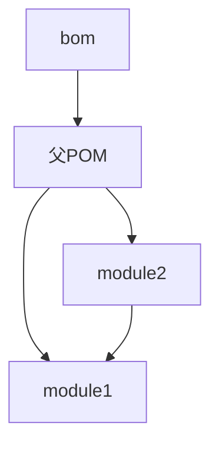

# Maven BOM 模板项目

[](https://github.com/helian-labs/maven-template-bom/actions/workflows/maven.yml)
[](https://www.apache.org/licenses/LICENSE-2.0)

## 简介

Maven BOM（Bill of Materials）模板项目是一个企业级多模块 Maven 项目的最佳实践示例。本项目通过统一的依赖版本管理和模块化设计，为开发团队提供了一个可靠的项目骨架，有效解决了大型项目中的依赖版本管理问题。

### 核心特性

- 🎯 **依赖统一管理**：通过 BOM 实现所有模块依赖版本的集中管理
- 📦 **标准化结构**：遵循 Maven 最佳实践的多模块项目结构
- 🔄 **持续集成/部署**：集成 GitHub Actions 实现自动化构建、测试和部署
- 🛡️ **质量保证**：内置代码质量检查和质量门禁机制
- 📚 **完整文档**：详尽的使用说明和开发指南

## 环境要求

- JDK 17 或更高版本
- Maven 3.6.3+ 或使用项目内置的 Maven Wrapper
- Git 2.x（可选，用于版本控制）

## 快速开始

### 1. 克隆项目

```bash
git clone https://github.com/helian-labs/maven-template-bom.git
cd maven-template-bom
```

### 2. 构建项目

使用 Maven Wrapper（推荐）：

```bash
./mvnw clean install
```

或使用本地 Maven：

```bash
mvn clean install
```

### 3. 验证安装

```bash
./mvnw verify
```

## 项目架构

### 模块说明

```
maven-template-bom/
├── bom/                 # 依赖版本管理中心
├── module1/            # 核心功能模块
├── module2/            # 业务功能模块
└── pom.xml            # 父级 POM 配置
```

### 架构设计



## 使用指南

### 在项目中引入 BOM

```xml
<dependencyManagement>
    <dependencies>
        <dependency>
            <groupId>com.helian</groupId>
            <artifactId>bom</artifactId>
            <version>${bom.version}</version>
            <type>pom</type>
            <scope>import</scope>
        </dependency>
    </dependencies>
</dependencyManagement>
```

### 使用统一管理的依赖

```xml
<dependencies>
    <dependency>
        <groupId>com.helian</groupId>
        <artifactId>module1</artifactId>
        <!-- 无需指定版本号 -->
    </dependency>
</dependencies>
```

## 开发规范

### 代码提交规范

提交信息格式：

```
<type>(<scope>): <subject>

<body>

<footer>
```

类型（type）：

- feat: 新功能
- fix: 修复
- docs: 文档更新
- style: 代码格式
- refactor: 重构
- test: 测试
- chore: 构建过程或辅助工具的变动

### 质量控制

- 所有代码必须通过单元测试
- 遵循阿里巴巴 Java 开发规范
- 保持代码覆盖率在 80% 以上
- 通过 SonarQube 质量门禁检查

## 常见问题

### 1. 依赖下载速度慢

配置阿里云 Maven 镜像：

```xml
<mirror>
    <id>aliyun</id>
    <mirrorOf>central</mirrorOf>
    <name>Aliyun Maven Mirror</name>
    <url>https://maven.aliyun.com/repository/public</url>
</mirror>
```

### 2. 版本冲突解决

使用 `mvn dependency:tree` 分析依赖树，找出冲突源。

## 维护者

- [@helian-labs](https://github.com/helian-labs)

## 许可证

本项目采用 [Apache License 2.0](LICENSE) 许可证。

## 参考资源

- [Maven 官方文档](https://maven.apache.org/guides/index.html)
- [Maven BOM 最佳实践](https://www.baeldung.com/spring-maven-bom)
- [语义化版本 2.0.0](https://semver.org/lang/zh-CN/)
